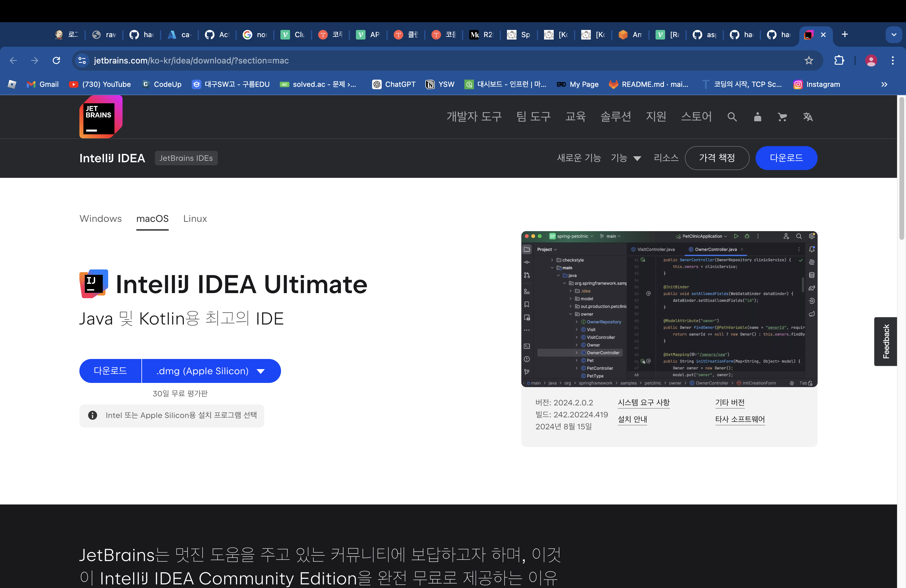

# `정신나갈것같네` - `Chapter.2`

해커그라운드 해커톤에 참여하는 `정신나갈것같네` 팀의 `Chapter.2`입니다.

## 참고 문서

> 아래 두 링크는 해커톤에서 앱을 개발하면서 참고할 만한 문서들입니다. 이 문서들에서 언급한 서비스 이외에도 더 많은 서비스들이 PaaS, SaaS, 서버리스 형태로 제공되니 참고하세요.

- [순한맛](./REFERENCES_BASIC.md)
- [매운맛](./REFERENCES_ADVANCED.md)

## 제품/서비스 소개

<!-- 아래 링크는 지우지 마세요 -->
[제품/서비스 소개 보기](TOPIC.md)
<!-- 위 링크는 지우지 마세요 -->

## 오픈 소스 라이센스

<!-- 아래 링크는 지우지 마세요 -->
[오픈소스 라이센스 보기](./LICENSE)
<!-- 위 링크는 지우지 마세요 -->

## 설치 방법

> **아래 제공하는 설치 방법을 통해 심사위원단이 여러분의 제품/서비스를 실제 Microsoft 애저 클라우드에 배포하고 설치할 수 있어야 합니다. 만약 아래 설치 방법대로 따라해서 배포 및 설치가 되지 않을 경우 본선에 진출할 수 없습니다.**

### 사전 준비 사항

> **여러분의 제품/서비스를 Microsoft 애저 클라우드에 배포하기 위해 사전에 필요한 준비 사항들을 적어주세요.**
> 
InteliJ, Docker Desktop, Github 계정, Microsoft 계정 (권한이 있어야합니다.), 자바 jdk-17가 필요합니다.
> https://www.jetbrains.com/ko-kr/idea/download/
> https://docs.docker.com/desktop/install/mac-install/
> 
해당 링크에 접속하여 InteliJ와 DockerDesktop을 설치해주세요. 사양은 본인의 환경에 맞게 설정합니다.

window에서의 InteliJ


Mac

다운로드가 완료되면 Next를 연타하여 다운로드를 완료합니다.

---

Docker 또한 자신의 운영체제 환경에 따라 클릭하여 다운받아주세요.


### Window
이 페이지에서는 둘 다 체크해주세요. 

설치가 완료되면 close를 눌러 설치를 완료합니다.

### Mac
운영체제 버전을 바꿔 다운로드해주고, 드래그하여 앱을 이동시켜줍니다.


이후 설치 파일을 실행하여 똑같이 진행하면 설치가 완료됩니다.

## 시작하기

>https://github.com/hackersground-kr/hg-byebye-team.git 링크를 복사합니다.
>
> 
>https://git-scm.com/ 에서 Git을 다운로드하고 설치합니다.
>
> 
>Next x5 -> Git from the command line~ 클릭 -> Next x6 을 하여 깃 설치를 마무리합니다. window
> 
>1. 아래 명령어를 터미널에 입력하여 Homebrew 설치를 시작합니다.
>   /bin/bash -c "$(curl -fsSL https://raw.githubusercontent.com/Homebrew/install/HEAD/install.sh)"
>2. password 문구가 나오면 mac 비밀번호를 입력하고 설치를 완료합니다.
>3. 이 명령어를 입력하여 Git 설치를 시작합니다. brew install git
>4. 설치가 완료되면 git --version을 입력하여 정상적으로 설치되었는지 확인합니다.
>5. 정상적으로 설치 되었다면 터미널을 종료합니다. mac

터미널(또는 명령 프롬프트)을 열고, 프로젝트를 저장할 폴더로 이동합니다. 예를 들어, 바탕화면에 클론하고 싶다면 다음과 같이 입력합니다
> cd ~/Desktop  <- Mac

> cd %USERPROFILE%\Desktop  <- Windows

리포지토리를 클론합니다.
> git clone https://github.com/hackersground-kr/hg-byebye-team.git
IntelliJ IDEA를 실행합니다.


처음 시작 시, “Open” 또는 “Import Project”를 선택합니다.


클론한 프로젝트 폴더를 선택하고 “OK”를 클릭합니다. **경고창이 나타날 시, Trust Project를 선택합니다.**


IntelliJ가 프로젝트 설정을 자동으로 인식하고 설정을 완료합니다.
   
프로젝트가 실행되면 File -> Project Structure를 클릭하여 들어갑니다.


SDK -> Add SDK -> Download JDK로 들어갑니다.


다음과 같이 선택하고 다운로드를 클릭합니다.


다운로드가 완료되었다면 Apply 후 OK를 클릭합니다.


인텔리제이를 재실행해 주세요. JDK가 정상적으로 설치 된 것을 확인하실 수 있습니다.

그리고 왼쪽 하단의 >_ 모양의 아이콘인 터미널을 클릭하여 실행 시킨 뒤, 콘솔에 다음 명령어를 입력해주세요.
./gradlew build -x test


Docker Desktop을 실행시킵니다.

mac의 터미널에서 해당 명령어를 입력합니다.
>brew install azure/azure-cli/azd
>
window의 경우
> winget install microsoft.azd

설치 후 
>azd login
>
을 입력하여 microsoft 계정을 이용해 로그인을 진행합니다. 로그인이 성공하면 로그인 페이지를 닫고 터미널로 돌아옵니다. 실패 시 계속 시도합니다.

이후, 해당 명령어를 입력합니다.

```
cd
cd Desktop/hg-common-hackergroud
azd init -e common-hackergroud
```
이후 SUCCESS라는 문구가 보이면 넘어갑니다.

>Use code in the current directory 를 마우스 위 아래 방향키로 선택한 후 엔터를 입력합니다.
> 
>마찬가지로 Confirm and continue initializing my app을 같은 방법으로 선택해줍니다.
> 
SUCCESS: Your app is ready for the cloud! 문구를 확인하면 성공하셨습니다! 

인텔리제이 왼쪽의 디렉토리 중 루트 디렉토리 하위에 존재하는 azure.yaml 파일을 선택합니다.

```
name: HackerGround
metadata:
template: azd-init@1.9.5
services:
HackerGround:
project: .
host: containerapp
language: java 
```
를 복사하여 붙여넣습니다.

이후 터미널에 azd up 명령어를 입력합니다.

>Select an Azure Subscription to use 문구에서 Hackers Ground 리소스 그룹을 키보드 위 아래 방향키로 선택하세요. 선택후 엔터를 누르시면 됩니다.

>Select an Azure location to use 문구에서는 13. (Asia Pacific) Korea South (koreacentral) 를 같은 방법으로 선택한 뒤 엔터를 누릅니다.

```Deploying services (azd deploy)
(✓) Done: Deploying service server
- Endpoint: 서버 url
(✓) Done: Deploying service web
- Endpoint: 웹 url

SUCCESS: Your up workflow to provision and deploy to Azure completed in 2 minutes 22 seconds.
```
가 뜨게 되면 배포에 성공하게 됩니다.

다음으로는 깃허브의 Git Actions를 이용한 CI/CD 구축을 진행하겠습니다.

터미널에서 다음 명령어를 입력합니다.

```
git init
git add .
git commit -m "First commit"
```

https://github.com/ 해당 링크를 통해 깃허브에 접속한 뒤에 로그인 합니다.

Profile 오른쪽의 프로필 사진을 클릭하여 프로필 메뉴에 접근합니다.

Your Repositories를 클릭하여 본인의 리포지토리 목록을 확인합니다.

오른쪽 상단의 초록색 new 버튼을 클릭하여 리포지토리를 생성합니다.

이름을 chapter-two로 설정합니다.

이후 쭉 내려가서 Create Repository를 클릭하여 리포지토리를 생성합니다.

생성 후 보이는 화면에서 https://github.com/{깃허브ID}/chapter-two.git 을 복사합니다.

InteliJ로 돌아와 터미널에서 다음 명령어를 입력합니다.
```
git remote add origin https://github.com/{깃허브ID}/chapter-two.git
```

그리고
```
git push origin main
```
명령어를 입력하여 메인 브랜치에 코드를 push합니다.

이후 터미널에 보이는 url을 클릭하여 다시 깃허브로 이동하여 commit & push가 제대로 진행 된 것을 확인합니다.

다시 InteliJ의 터미널에 접속하여 
```
cd $REPOSITORY_ROOT
mkdir -p .github/workflows
cd $REPOSITORY_ROOT
```
를 입력합니다.

> azd pipeline config
> 
를 입력하여 파이프라인 구축을 진행합니다.

설정 마지막에 Would you like to commit and push your local changes to start the configured CI pipeline? 라는 질문이 나오면 n를 선택하고 종료합니다.

```
curl \
https://raw.githubusercontent.com/Azure-Samples/azd-starter-bicep/main/.github/workflows/azure-dev.yml \
--output $REPOSITORY_ROOT/.github/workflows/azure-dev.yml
```
를 입력하여 워크플로우 파일을 생성합니다.

/github 디렉토리 안에 위치한 workflows 디렉토리에 들어가서 azure-dev.yml 파일을 들어갑니다.
```
name: Deploy to Azure Container Apps

on:
workflow_dispatch:
push:
branches:
- backend

permissions:
id-token: write
contents: read

jobs:
build:
runs-on: ubuntu-latest
env:
AZURE_CLIENT_ID: ${{ vars.AZURE_CLIENT_ID }}
AZURE_TENANT_ID: ${{ vars.AZURE_TENANT_ID }}
AZURE_SUBSCRIPTION_ID: ${{ vars.AZURE_SUBSCRIPTION_ID }}
AZURE_RESOURCE_GROUP: ${{ vars.AZURE_RESOURCE_GROUP }}
AZURE_LOCATION: ${{ vars.AZURE_LOCATION }}
AZURE_ENV_NAME: ${{ vars.AZURE_ENV_NAME }}
DATABASE_URL: ${{ secrets.DB_URL }}
DATABASE_USER: ${{ secrets.DB_USERNAME }}
DATABASE_PASSWORD: ${{ secrets.DB_PASSWORD }}

    steps:
      - name: Checkout
        uses: actions/checkout@v3

      - name: Set up JDK 17
        uses: actions/setup-java@v3
        with:
          java-version: '17'
          distribution: 'temurin'

      - name: yaml file setting
        run: |
          echo "${{ secrets.APPLICATION_YAML }}" > ./src/main/resources/application.yaml

      - name: Grant execute permission for gradlew
        run: chmod +x gradlew

      - name: Build with Gradle
        run: ./gradlew build

      - name: Docker build
        run: |
          echo ${{ secrets.DOCKER_PASSWORD }} | docker login -u ${{ secrets.DOCKER_USERNAME }} --password-stdin
          docker build -t ${{ secrets.DOCKER_USERNAME }}/uiseong-come-on .
          docker push ${{ secrets.DOCKER_USERNAME }}/uiseong-come-on:latest

      - name: Install azd
        uses: Azure/setup-azd@v1.0.0

      - name: Log in with Azure (Federated Credentials)
        if: ${{ env.AZURE_CLIENT_ID != '' }}
        run: |
          azd auth login `
            --client-id "$Env:AZURE_CLIENT_ID" `
            --federated-credential-provider "github" `
            --tenant-id "$Env:AZURE_TENANT_ID"
        shell: pwsh

      - name: Log in with Azure (Client Credentials)
        if: ${{ env.AZURE_CREDENTIALS != '' }}
        run: |
          $info = $Env:AZURE_CREDENTIALS | ConvertFrom-Json -AsHashtable
          Write-Host "::add-mask::$($info.clientSecret)"
          
          azd auth login \
            --client-id "$($info.clientId)" \
            --client-secret "$($info.clientSecret)" \
            --tenant-id "$($info.tenantId)"
        shell: pwsh
        env:
          AZURE_CREDENTIALS: ${{ env.AZURE_CREDENTIALS }}

      - name: Provision Infrastructure
        run: |
          azd provision --environment ${{ env.AZURE_ENV_NAME }} --no-prompt
        env:
          AZD_INITIAL_ENVIRONMENT_CONFIG: ${{ secrets.AZD_INITIAL_ENVIRONMENT_CONFIG }}

      - name: Deploy Application
        run: |
          azd deploy --environment ${{ env.AZURE_ENV_NAME }} --no-prompt
```

를 복사하여 붙여넣습니다.

다시 깃허브로 복귀하여 리포지토리 화면에 도착합니다.

위쪽에 settings를 클릭하고, 왼쪽 아래의 Secrets & Variables를 클릭한 다음 바로 밑에 있는 actions를 클릭하세요.

오른쪽에 초록색 버튼의 New Repository Secret을 클릭한 뒤에, Name과 Secret 칸에 각각 해당 키워드를 입력해주세요.
```
NAME                Secret
DB_PASSWORD        설정한 DB 비밀번호
DB_URL             DB URL
DB_USERNAME        DB의 유저 이름 ex) root
DB_PASSWORD        DB의 비밀번호
DOCKER_USERNAME    도커 유저 ID
DOCKER_PASSWORD    비밀번호
```
위와 같이 입력하신 후, InteliJ로 돌아와 터미널에
```
git add .
git commit -m "Add GitHub Actions workflow for Azure deployment"
git push
```
를 입력하여 커밋을 진행합니다. GitHub 리포지토리의 Actions 탭에서 Azure Dev 워크플로우가 돌아가는 것을 확인합니다.

GitHub Actions 워크플로우가 성공적으로 끝나면 로그 화면에서 아래와 같은 링크를 볼 수 있습니다. 이를 클릭해서 정상적으로 작동하는지 확인합니다.
성공적으로 작동한다면 배포가 모두 완료되었습니다.
> **여러분의 제품/서비스를 Microsoft 애저 클라우드에 배포하기 위한 절차를 구체적으로 나열해 주세요.**
